# Inception Phase - Mermaid Flow Diagram

## Overview
This diagram shows how steering files guide the creation of artifacts during the Inception Phase.

```mermaid
graph TD
    Start([User Request]) --> WD[Workspace Detection]
    
    %% Workspace Detection
    WD -->|Reads| WD_Rule[.kiro/aws-aidlc-rule-details/<br/>inception/workspace-detection.md]
    WD_Rule -->|Creates| WD_Plan[aidlc-docs/inception/plans/<br/>workspace-detection.md]
    WD_Plan -->|Determines| WD_Type{Project Type?}
    WD_Type -->|Greenfield| Skip_RE[Skip Reverse Engineering]
    WD_Type -->|Brownfield| RE[Reverse Engineering]
    
    %% Requirements Analysis
    Skip_RE --> RA[Requirements Analysis]
    WD_Rule -->|Guides| RA
    RA -->|Reads| RA_Rule[.kiro/aws-aidlc-rule-details/<br/>inception/requirements-analysis.md]
    RA_Rule -->|Creates| RA_Questions[aidlc-docs/inception/requirements/<br/>requirement-verification-questions.md]
    RA_Questions -->|User Answers| RA_Check{Contradictions?}
    RA_Check -->|Yes| RA_Clarify[aidlc-docs/inception/requirements/<br/>requirement-clarification-questions.md]
    RA_Check -->|No| RA_Doc
    RA_Clarify -->|User Answers| RA_Doc[aidlc-docs/inception/requirements/<br/>requirements.md]
    RA_Doc -->|Updates| State1[aidlc-state.md]
    RA_Doc -->|Logs| Audit1[audit.md]
    
    %% User Stories
    RA_Doc --> US[User Stories]
    US -->|Reads| US_Rule[.kiro/aws-aidlc-rule-details/<br/>inception/user-stories.md]
    US_Rule -->|Creates| US_Plan[aidlc-docs/inception/plans/<br/>story-generation-plan.md]
    US_Plan -->|User Answers| US_Check{Ambiguities?}
    US_Check -->|Yes| US_Clarify[aidlc-docs/inception/plans/<br/>story-planning-clarification.md]
    US_Check -->|No| US_Gen
    US_Clarify -->|User Answers| US_Gen[Generate Stories]
    US_Gen -->|Creates| US_Personas[aidlc-docs/inception/user-stories/<br/>personas.md]
    US_Gen -->|Creates| US_Stories[aidlc-docs/inception/user-stories/<br/>stories.md]
    US_Stories -->|Updates| State2[aidlc-state.md]
    US_Stories -->|Logs| Audit2[audit.md]
    
    %% Workflow Planning
    US_Stories --> WP[Workflow Planning]
    WP -->|Reads| WP_Rule[.kiro/aws-aidlc-rule-details/<br/>inception/workflow-planning.md]
    WP_Rule -->|Reads| CV_Rule[.kiro/aws-aidlc-rule-details/<br/>common/content-validation.md]
    WP -->|Loads| RA_Doc
    WP -->|Loads| US_Stories
    WP -->|Creates| WP_Plan[aidlc-docs/inception/plans/<br/>execution-plan.md]
    WP_Plan -->|Validates Mermaid| CV_Rule
    WP_Plan -->|Updates| State3[aidlc-state.md]
    WP_Plan -->|Logs| Audit3[audit.md]
    
    %% Application Design
    WP_Plan --> AD[Application Design]
    AD -->|Reads| AD_Rule[.kiro/aws-aidlc-rule-details/<br/>inception/application-design.md]
    AD_Rule -->|Creates| AD_Plan[aidlc-docs/inception/plans/<br/>application-design-plan.md]
    AD_Plan -->|User Answers| AD_Gen[Generate Design]
    AD_Gen -->|Creates| AD_Comp[aidlc-docs/inception/application-design/<br/>components.md]
    AD_Gen -->|Creates| AD_Methods[aidlc-docs/inception/application-design/<br/>component-methods.md]
    AD_Gen -->|Creates| AD_Services[aidlc-docs/inception/application-design/<br/>services.md]
    AD_Gen -->|Creates| AD_Deps[aidlc-docs/inception/application-design/<br/>component-dependency.md]
    AD_Deps -->|Updates| State4[aidlc-state.md]
    AD_Deps -->|Logs| Audit4[audit.md]
    
    %% Units Generation
    AD_Deps --> UG[Units Generation]
    UG -->|Reads| UG_Rule[.kiro/aws-aidlc-rule-details/<br/>inception/units-generation.md]
    UG_Rule -->|Creates| UG_Plan[aidlc-docs/inception/plans/<br/>unit-of-work-plan.md]
    UG_Plan -->|User Answers| UG_Gen[Generate Units]
    UG_Gen -->|Creates| UG_Units[aidlc-docs/inception/application-design/<br/>unit-of-work.md]
    UG_Gen -->|Creates| UG_UnitDeps[aidlc-docs/inception/application-design/<br/>unit-of-work-dependency.md]
    UG_Gen -->|Creates| UG_StoryMap[aidlc-docs/inception/application-design/<br/>unit-of-work-story-map.md]
    UG_StoryMap -->|Updates| State5[aidlc-state.md]
    UG_StoryMap -->|Logs| Audit5[audit.md]
    
    %% End of Inception
    UG_StoryMap --> End([Inception Complete<br/>Ready for Construction])
    
    %% Styling
    classDef steeringFile fill:#e1f5ff,stroke:#01579b,stroke-width:2px
    classDef planFile fill:#fff9c4,stroke:#f57f17,stroke-width:2px
    classDef artifactFile fill:#c8e6c9,stroke:#2e7d32,stroke-width:2px
    classDef stateFile fill:#ffccbc,stroke:#d84315,stroke-width:2px
    classDef decision fill:#f3e5f5,stroke:#6a1b9a,stroke-width:2px
    
    class WD_Rule,RA_Rule,US_Rule,WP_Rule,CV_Rule,AD_Rule,UG_Rule steeringFile
    class WD_Plan,RA_Questions,RA_Clarify,US_Plan,US_Clarify,WP_Plan,AD_Plan,UG_Plan planFile
    class RA_Doc,US_Personas,US_Stories,AD_Comp,AD_Methods,AD_Services,AD_Deps,UG_Units,UG_UnitDeps,UG_StoryMap artifactFile
    class State1,State2,State3,State4,State5,Audit1,Audit2,Audit3,Audit4,Audit5 stateFile
    class WD_Type,RA_Check,US_Check decision
```

## Legend

- **Blue boxes**: Steering files (rules that guide the process)
- **Yellow boxes**: Plan files (questions and clarifications)
- **Green boxes**: Artifact files (deliverables)
- **Orange boxes**: State tracking files (aidlc-state.md, audit.md)
- **Purple diamonds**: Decision points

## Key Insights

1. **Steering files are read-only**: They guide the process but are never modified
2. **Plans come first**: Each stage creates a plan with questions before generating artifacts
3. **User answers drive generation**: Artifacts are created based on user's answers to plan questions
4. **State is continuously updated**: aidlc-state.md and audit.md track progress throughout
5. **Artifacts build on each other**: Later stages load artifacts from earlier stages
6. **Content validation**: Mermaid diagrams and other content are validated before file creation
