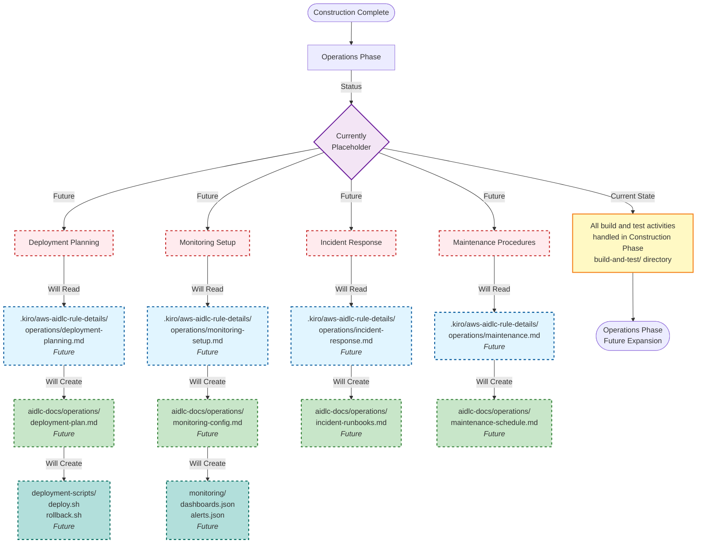

# Operations Phase - Mermaid Flow Diagram

## Overview
This diagram shows the Operations Phase structure (currently a placeholder for future expansion).

## Legend

- **Dashed blue boxes**: Future steering files (not yet implemented)
- **Dashed green boxes**: Future artifact files (not yet implemented)
- **Dashed teal boxes**: Future code/config files (not yet implemented)
- **Red dashed boxes**: Future stages (not yet implemented)
- **Yellow box**: Current state note
- **Purple diamond**: Decision point

## Current State

The Operations Phase is currently a **placeholder** for future expansion. All operational activities (build, test, deployment) are currently handled in the Construction Phase's `build-and-test/` directory.

## Future Expansion Plans

When the Operations Phase is implemented, it will include:

1. **Deployment Planning**
   - Deployment strategies (blue-green, canary, rolling)
   - Environment configuration
   - Deployment scripts and automation
   - Rollback procedures

2. **Monitoring and Observability**
   - Metrics collection setup
   - Dashboard configuration
   - Alert definitions
   - Log aggregation

3. **Incident Response**
   - Incident runbooks
   - Escalation procedures
   - Post-mortem templates
   - Communication protocols

4. **Maintenance and Support**
   - Maintenance windows
   - Backup and recovery procedures
   - Performance tuning
   - Security patching

## Key Insights

1. **Placeholder status**: Operations Phase exists in the workflow but is not yet implemented
2. **Future-ready**: The structure is designed to accommodate operational concerns when needed
3. **Current workaround**: Build and test instructions are generated in Construction Phase
4. **Phased approach**: Operations capabilities will be added as the AI-DLC methodology matures
