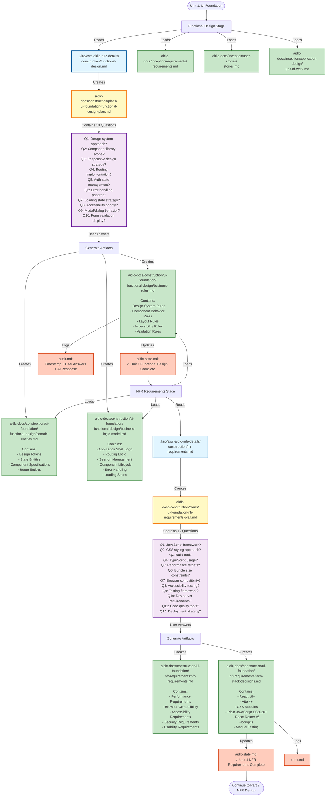

# Unit 1: UI Foundation - Detailed Flow (Part 1)

## Functional Design, NFR Requirements, and NFR Design Stages

```mermaid
graph TD
    Start([Unit 1: UI Foundation]) --> FD[Functional Design Stage]
    
    %% Functional Design
    FD -->|Reads| FD_Rule[.kiro/aws-aidlc-rule-details/<br/>construction/functional-design.md]
    FD -->|Loads| Req[aidlc-docs/inception/requirements/<br/>requirements.md]
    FD -->|Loads| Stories[aidlc-docs/inception/user-stories/<br/>stories.md]
    FD -->|Loads| UOW[aidlc-docs/inception/application-design/<br/>unit-of-work.md]
    
    FD_Rule -->|Creates| FD_Plan[aidlc-docs/construction/plans/<br/>ui-foundation-functional-design-plan.md]
    FD_Plan -->|Contains 10 Questions| FD_Q[Q1: Design system approach?<br/>Q2: Component library scope?<br/>Q3: Responsive design strategy?<br/>Q4: Routing implementation?<br/>Q5: Auth state management?<br/>Q6: Error handling patterns?<br/>Q7: Loading state strategy?<br/>Q8: Accessibility priority?<br/>Q9: Modal/dialog behavior?<br/>Q10: Form validation display?]
    
    FD_Q -->|User Answers| FD_Gen[Generate Artifacts]
    FD_Gen -->|Creates| FD_Entities[aidlc-docs/construction/ui-foundation/<br/>functional-design/domain-entities.md<br/><br/>Contains:<br/>- Design Tokens<br/>- State Entities<br/>- Component Specifications<br/>- Route Entities]
    
    FD_Gen -->|Creates| FD_Logic[aidlc-docs/construction/ui-foundation/<br/>functional-design/business-logic-model.md<br/><br/>Contains:<br/>- Application Shell Logic<br/>- Routing Logic<br/>- Session Management<br/>- Component Lifecycle<br/>- Error Handling<br/>- Loading States]
    
    FD_Gen -->|Creates| FD_Rules[aidlc-docs/construction/ui-foundation/<br/>functional-design/business-rules.md<br/><br/>Contains:<br/>- Design System Rules<br/>- Component Behavior Rules<br/>- Layout Rules<br/>- Accessibility Rules<br/>- Validation Rules]
    
    FD_Rules -->|Updates| State1[aidlc-state.md:<br/>✓ Unit 1 Functional Design Complete]
    FD_Rules -->|Logs| Audit1[audit.md:<br/>Timestamp + User Answers + AI Response]
    
    %% NFR Requirements
    State1 --> NFR_Req[NFR Requirements Stage]
    NFR_Req -->|Reads| NFR_Req_Rule[.kiro/aws-aidlc-rule-details/<br/>construction/nfr-requirements.md]
    NFR_Req -->|Loads| FD_Entities
    NFR_Req -->|Loads| FD_Logic
    NFR_Req -->|Loads| FD_Rules
    
    NFR_Req_Rule -->|Creates| NFR_Req_Plan[aidlc-docs/construction/plans/<br/>ui-foundation-nfr-requirements-plan.md]
    NFR_Req_Plan -->|Contains 12 Questions| NFR_Req_Q[Q1: JavaScript framework?<br/>Q2: CSS styling approach?<br/>Q3: Build tool?<br/>Q4: TypeScript usage?<br/>Q5: Performance targets?<br/>Q6: Bundle size constraints?<br/>Q7: Browser compatibility?<br/>Q8: Accessibility testing?<br/>Q9: Testing framework?<br/>Q10: Dev server requirements?<br/>Q11: Code quality tools?<br/>Q12: Deployment strategy?]
    
    NFR_Req_Q -->|User Answers| NFR_Req_Gen[Generate Artifacts]
    NFR_Req_Gen -->|Creates| NFR_Req_Doc[aidlc-docs/construction/ui-foundation/<br/>nfr-requirements/nfr-requirements.md<br/><br/>Contains:<br/>- Performance Requirements<br/>- Browser Compatibility<br/>- Accessibility Requirements<br/>- Security Requirements<br/>- Usability Requirements]
    
    NFR_Req_Gen -->|Creates| NFR_Tech[aidlc-docs/construction/ui-foundation/<br/>nfr-requirements/tech-stack-decisions.md<br/><br/>Contains:<br/>- React 18+<br/>- Vite 4+<br/>- CSS Modules<br/>- Plain JavaScript ES2020+<br/>- React Router v6<br/>- bcryptjs<br/>- Manual Testing]
    
    NFR_Tech -->|Updates| State2[aidlc-state.md:<br/>✓ Unit 1 NFR Requirements Complete]
    NFR_Tech -->|Logs| Audit2[audit.md]
    
    State2 --> Continue([Continue to Part 2:<br/>NFR Design])
    
    %% Styling
    classDef steeringFile fill:#e1f5ff,stroke:#01579b,stroke-width:2px
    classDef planFile fill:#fff9c4,stroke:#f57f17,stroke-width:2px
    classDef artifactFile fill:#c8e6c9,stroke:#2e7d32,stroke-width:2px
    classDef stateFile fill:#ffccbc,stroke:#d84315,stroke-width:2px
    classDef questions fill:#f3e5f5,stroke:#6a1b9a,stroke-width:2px
    
    class FD_Rule,NFR_Req_Rule steeringFile
    class FD_Plan,NFR_Req_Plan planFile
    class Req,Stories,UOW,FD_Entities,FD_Logic,FD_Rules,NFR_Req_Doc,NFR_Tech artifactFile
    class State1,State2,Audit1,Audit2 stateFile
    class FD_Q,NFR_Req_Q questions
```
