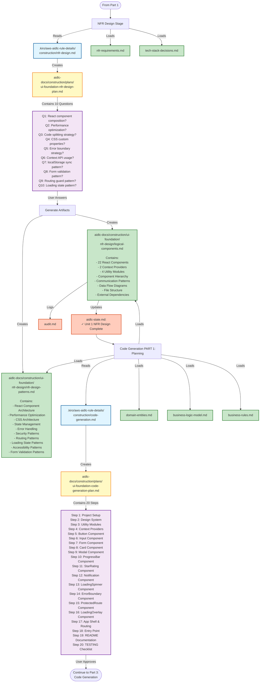

# Unit 1: UI Foundation - Detailed Flow (Part 2)

## NFR Design and Code Generation Planning Stages

```mermaid
graph TD
    Start([From Part 1]) --> NFR_Des[NFR Design Stage]
    
    %% NFR Design
    NFR_Des -->|Reads| NFR_Des_Rule[.kiro/aws-aidlc-rule-details/<br/>construction/nfr-design.md]
    NFR_Des -->|Loads| NFR_Req_Doc[nfr-requirements.md]
    NFR_Des -->|Loads| NFR_Tech[tech-stack-decisions.md]
    
    NFR_Des_Rule -->|Creates| NFR_Des_Plan[aidlc-docs/construction/plans/<br/>ui-foundation-nfr-design-plan.md]
    NFR_Des_Plan -->|Contains 10 Questions| NFR_Des_Q[Q1: React component composition?<br/>Q2: Performance optimization?<br/>Q3: Code splitting strategy?<br/>Q4: CSS custom properties?<br/>Q5: Error boundary strategy?<br/>Q6: Context API usage?<br/>Q7: localStorage sync pattern?<br/>Q8: Form validation pattern?<br/>Q9: Routing guard pattern?<br/>Q10: Loading state pattern?]
    
    NFR_Des_Q -->|User Answers| NFR_Des_Gen[Generate Artifacts]
    NFR_Des_Gen -->|Creates| NFR_Patterns[aidlc-docs/construction/ui-foundation/<br/>nfr-design/nfr-design-patterns.md<br/><br/>Contains:<br/>- React Component Architecture<br/>- Performance Optimization<br/>- CSS Architecture<br/>- State Management<br/>- Error Handling<br/>- Security Patterns<br/>- Routing Patterns<br/>- Loading State Patterns<br/>- Accessibility Patterns<br/>- Form Validation Patterns]
    
    NFR_Des_Gen -->|Creates| NFR_Components[aidlc-docs/construction/ui-foundation/<br/>nfr-design/logical-components.md<br/><br/>Contains:<br/>- 22 React Components<br/>- 2 Context Providers<br/>- 4 Utility Modules<br/>- Component Hierarchy<br/>- Communication Patterns<br/>- Data Flow Diagrams<br/>- File Structure<br/>- External Dependencies]
    
    NFR_Components -->|Updates| State3[aidlc-state.md:<br/>✓ Unit 1 NFR Design Complete]
    NFR_Components -->|Logs| Audit3[audit.md]
    
    %% Code Generation Planning
    State3 --> CG_Plan_Stage[Code Generation PART 1:<br/>Planning]
    CG_Plan_Stage -->|Reads| CG_Rule[.kiro/aws-aidlc-rule-details/<br/>construction/code-generation.md]
    CG_Plan_Stage -->|Loads| FD_Entities[domain-entities.md]
    CG_Plan_Stage -->|Loads| FD_Logic[business-logic-model.md]
    CG_Plan_Stage -->|Loads| FD_Rules[business-rules.md]
    CG_Plan_Stage -->|Loads| NFR_Patterns
    CG_Plan_Stage -->|Loads| NFR_Components
    
    CG_Rule -->|Creates| CG_Plan[aidlc-docs/construction/plans/<br/>ui-foundation-code-generation-plan.md]
    CG_Plan -->|Contains 20 Steps| CG_Steps[Step 1: Project Setup<br/>Step 2: Design System<br/>Step 3: Utility Modules<br/>Step 4: Context Providers<br/>Step 5: Button Component<br/>Step 6: Input Component<br/>Step 7: Form Component<br/>Step 8: Card Component<br/>Step 9: Modal Component<br/>Step 10: ProgressBar Component<br/>Step 11: StarRating Component<br/>Step 12: Notification Component<br/>Step 13: LoadingSpinner Component<br/>Step 14: ErrorBoundary Component<br/>Step 15: ProtectedRoute Component<br/>Step 16: LoadingOverlay Component<br/>Step 17: App Shell & Routing<br/>Step 18: Entry Point<br/>Step 19: README Documentation<br/>Step 20: TESTING Checklist]
    
    CG_Steps -->|User Approves| Continue([Continue to Part 3:<br/>Code Generation])
    
    %% Styling
    classDef steeringFile fill:#e1f5ff,stroke:#01579b,stroke-width:2px
    classDef planFile fill:#fff9c4,stroke:#f57f17,stroke-width:2px
    classDef artifactFile fill:#c8e6c9,stroke:#2e7d32,stroke-width:2px
    classDef stateFile fill:#ffccbc,stroke:#d84315,stroke-width:2px
    classDef questions fill:#f3e5f5,stroke:#6a1b9a,stroke-width:2px
    
    class NFR_Des_Rule,CG_Rule steeringFile
    class NFR_Des_Plan,CG_Plan planFile
    class NFR_Req_Doc,NFR_Tech,NFR_Patterns,NFR_Components,FD_Entities,FD_Logic,FD_Rules artifactFile
    class State3,Audit3 stateFile
    class NFR_Des_Q,CG_Steps questions
```
