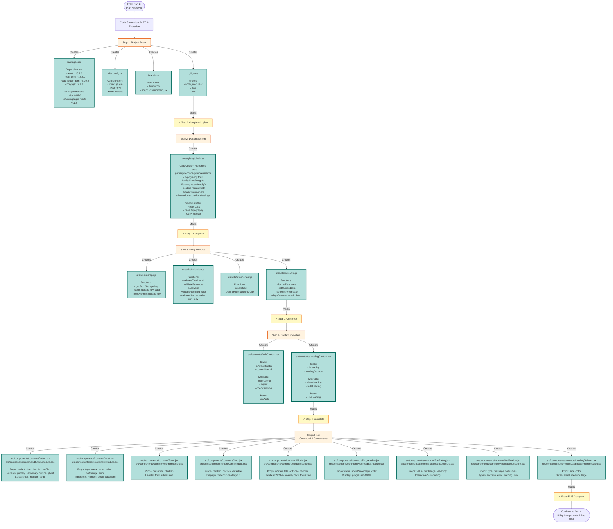

# Unit 1: UI Foundation - Detailed Flow (Part 3)

## Code Generation Execution Stage

```mermaid
graph TD
    Start([From Part 2:<br/>Plan Approved]) --> CG_Gen[Code Generation PART 2:<br/>Execution]
    
    %% Step 1: Project Setup
    CG_Gen --> Step1[Step 1: Project Setup]
    Step1 -->|Creates| File1_1[package.json<br/><br/>Dependencies:<br/>- react: ^18.2.0<br/>- react-dom: ^18.2.0<br/>- react-router-dom: ^6.20.0<br/>- bcryptjs: ^2.4.3<br/><br/>DevDependencies:<br/>- vite: ^4.5.0<br/>- @vitejs/plugin-react: ^4.2.0]
    
    Step1 -->|Creates| File1_2[vite.config.js<br/><br/>Configuration:<br/>- React plugin<br/>- Port 5173<br/>- HMR enabled]
    
    Step1 -->|Creates| File1_3[index.html<br/><br/>Root HTML:<br/>- div id=root<br/>- script src=/src/main.jsx]
    
    Step1 -->|Creates| File1_4[.gitignore<br/><br/>Ignores:<br/>- node_modules/<br/>- dist/<br/>- .env]
    
    File1_4 -->|Marks| Check1[✓ Step 1 Complete in plan]
    
    %% Step 2: Design System
    Check1 --> Step2[Step 2: Design System]
    Step2 -->|Creates| File2[src/styles/global.css<br/><br/>CSS Custom Properties:<br/>- Colors primary/secondary/success/error<br/>- Typography font-family/sizes/weights<br/>- Spacing xs/sm/md/lg/xl<br/>- Borders radius/width<br/>- Shadows sm/md/lg<br/>- Animations durations/easings<br/><br/>Global Styles:<br/>- Reset CSS<br/>- Base typography<br/>- Utility classes]
    
    File2 -->|Marks| Check2[✓ Step 2 Complete]
    
    %% Step 3: Utility Modules
    Check2 --> Step3[Step 3: Utility Modules]
    Step3 -->|Creates| File3_1[src/utils/storage.js<br/><br/>Functions:<br/>- getFromStorage key<br/>- setToStorage key, data<br/>- removeFromStorage key]
    
    Step3 -->|Creates| File3_2[src/utils/validation.js<br/><br/>Functions:<br/>- validateEmail email<br/>- validatePassword password<br/>- validateRequired value<br/>- validateNumber value, min, max]
    
    Step3 -->|Creates| File3_3[src/utils/idGenerator.js<br/><br/>Functions:<br/>- generateId<br/>Uses crypto.randomUUID]
    
    Step3 -->|Creates| File3_4[src/utils/dateUtils.js<br/><br/>Functions:<br/>- formatDate date<br/>- getCurrentDate<br/>- getMonthYear date<br/>- daysBetween date1, date2]
    
    File3_4 -->|Marks| Check3[✓ Step 3 Complete]
    
    %% Step 4: Context Providers
    Check3 --> Step4[Step 4: Context Providers]
    Step4 -->|Creates| File4_1[src/contexts/AuthContext.jsx<br/><br/>State:<br/>- isAuthenticated<br/>- currentUserId<br/><br/>Methods:<br/>- login userId<br/>- logout<br/>- checkSession<br/><br/>Hook:<br/>- useAuth]
    
    Step4 -->|Creates| File4_2[src/contexts/LoadingContext.jsx<br/><br/>State:<br/>- isLoading<br/>- loadingCounter<br/><br/>Methods:<br/>- showLoading<br/>- hideLoading<br/><br/>Hook:<br/>- useLoading]
    
    File4_2 -->|Marks| Check4[✓ Step 4 Complete]
    
    %% Steps 5-13: Common UI Components
    Check4 --> Step5_13[Steps 5-13:<br/>Common UI Components]
    Step5_13 -->|Creates| File5[src/components/common/Button.jsx<br/>src/components/common/Button.module.css<br/><br/>Props: variant, size, disabled, onClick<br/>Variants: primary, secondary, outline, ghost<br/>Sizes: small, medium, large]
    
    Step5_13 -->|Creates| File6[src/components/common/Input.jsx<br/>src/components/common/Input.module.css<br/><br/>Props: type, name, label, value, onChange, error<br/>Types: text, number, email, password]
    
    Step5_13 -->|Creates| File7[src/components/common/Form.jsx<br/>src/components/common/Form.module.css<br/><br/>Props: onSubmit, children<br/>Handles form submission]
    
    Step5_13 -->|Creates| File8[src/components/common/Card.jsx<br/>src/components/common/Card.module.css<br/><br/>Props: children, onClick, clickable<br/>Displays content in card layout]
    
    Step5_13 -->|Creates| File9[src/components/common/Modal.jsx<br/>src/components/common/Modal.module.css<br/><br/>Props: isOpen, title, onClose, children<br/>Handles ESC key, overlay click, focus trap]
    
    Step5_13 -->|Creates| File10[src/components/common/ProgressBar.jsx<br/>src/components/common/ProgressBar.module.css<br/><br/>Props: value, showPercentage, color<br/>Displays progress 0-100%]
    
    Step5_13 -->|Creates| File11[src/components/common/StarRating.jsx<br/>src/components/common/StarRating.module.css<br/><br/>Props: value, onChange, readOnly<br/>Interactive 5-star rating]
    
    Step5_13 -->|Creates| File12[src/components/common/Notification.jsx<br/>src/components/common/Notification.module.css<br/><br/>Props: type, message, onDismiss<br/>Types: success, error, warning, info]
    
    Step5_13 -->|Creates| File13[src/components/common/LoadingSpinner.jsx<br/>src/components/common/LoadingSpinner.module.css<br/><br/>Props: size, color<br/>Sizes: small, medium, large]
    
    File13 -->|Marks| Check5_13[✓ Steps 5-13 Complete]
    
    Check5_13 --> Continue([Continue to Part 4:<br/>Utility Components & App Shell])
    
    %% Styling
    classDef codeFile fill:#b2dfdb,stroke:#00695c,stroke-width:3px
    classDef checkpoint fill:#fff9c4,stroke:#f57f17,stroke-width:2px
    classDef stage fill:#fff3e0,stroke:#e65100,stroke-width:2px
    
    class File1_1,File1_2,File1_3,File1_4,File2,File3_1,File3_2,File3_3,File3_4,File4_1,File4_2,File5,File6,File7,File8,File9,File10,File11,File12,File13 codeFile
    class Check1,Check2,Check3,Check4,Check5_13 checkpoint
    class Step1,Step2,Step3,Step4,Step5_13 stage
```
