# Unit 1: UI Foundation - Detailed Flow (Part 4)

## Code Generation Execution - Final Steps

```mermaid
graph TD
    Start([From Part 3]) --> Step14_16[Steps 14-16:<br/>Utility Components]
    
    %% Utility Components
    Step14_16 -->|Creates| File14[src/components/ErrorBoundary.jsx<br/>src/components/ErrorBoundary.module.css<br/><br/>State:<br/>- hasError<br/>- error<br/><br/>Methods:<br/>- componentDidCatch<br/>- resetError<br/><br/>Displays error UI with Try Again button]
    
    Step14_16 -->|Creates| File15[src/components/ProtectedRoute.jsx<br/><br/>Props: children<br/><br/>Logic:<br/>- Check isAuthenticated from AuthContext<br/>- Redirect to /login if not authenticated<br/>- Render children if authenticated]
    
    Step14_16 -->|Creates| File16[src/components/LoadingOverlay.jsx<br/>src/components/LoadingOverlay.module.css<br/><br/>Uses LoadingContext<br/>Displays when isLoading is true<br/>Shows LoadingSpinner + optional message<br/>Fixed position overlay z-index 9999]
    
    File16 -->|Marks| Check14_16[✓ Steps 14-16 Complete]
    
    %% Step 17: App Shell & Routing
    Check14_16 --> Step17[Step 17: App Shell & Routing]
    Step17 -->|Creates| File17_1[src/App.jsx<br/>src/App.module.css<br/><br/>Structure:<br/>- AuthProvider wrapper<br/>- LoadingProvider wrapper<br/>- ErrorBoundary wrapper<br/>- BrowserRouter<br/>- Routes configuration<br/>- Header with navigation<br/><br/>Routes:<br/>- / → redirect to /login<br/>- /login → PlaceholderComponent<br/>- /register → PlaceholderComponent<br/>- /books → ProtectedRoute PlaceholderComponent<br/>- /statistics → ProtectedRoute PlaceholderComponent<br/>- /search → ProtectedRoute PlaceholderComponent<br/>- /export → ProtectedRoute PlaceholderComponent]
    
    Step17 -->|Creates| File17_2[src/components/PlaceholderComponent.jsx<br/>src/components/PlaceholderComponent.module.css<br/><br/>Props: title<br/>Displays placeholder message<br/>Used for routes not yet implemented]
    
    File17_2 -->|Marks| Check17[✓ Step 17 Complete]
    
    %% Step 18: Entry Point
    Check17 --> Step18[Step 18: Entry Point]
    Step18 -->|Creates| File18[src/main.jsx<br/><br/>Imports:<br/>- React, ReactDOM<br/>- App component<br/>- global.css<br/><br/>Renders:<br/>- React.StrictMode<br/>- App component<br/>- Into div#root]
    
    File18 -->|Marks| Check18[✓ Step 18 Complete]
    
    %% Step 19: README Documentation
    Check18 --> Step19[Step 19: README]
    Step19 -->|Creates| File19[README.md<br/><br/>Sections:<br/>- Project Overview<br/>- Features Implemented<br/>- Technology Stack<br/>- Project Structure<br/>- Design System<br/>- Component Usage Examples<br/>- Getting Started<br/>- Available Scripts<br/>- Development Status<br/>- Browser Support<br/>- Data Storage<br/>- Security<br/>- Accessibility<br/>- License]
    
    File19 -->|Marks| Check19[✓ Step 19 Complete]
    
    %% Step 20: TESTING Checklist
    Check19 --> Step20[Step 20: TESTING Checklist]
    Step20 -->|Creates| File20[TESTING.md<br/><br/>Sections:<br/>- Setup Testing<br/>- Design System Testing<br/>- Component Testing all 9 common UI<br/>- Utility Component Testing<br/>- Context Testing<br/>- Utility Module Testing<br/>- Routing Testing<br/>- Accessibility Testing<br/>- Responsive Design Testing<br/>- Browser Compatibility Testing<br/>- Performance Testing<br/>- Error Handling Testing<br/>- Success Criteria<br/><br/>Total: 200+ test checkboxes]
    
    File20 -->|Marks| Check20[✓ Step 20 Complete]
    
    %% All Steps Complete
    Check20 --> AllComplete[All 20 Steps Complete]
    AllComplete -->|Updates| State_Final[aidlc-state.md:<br/>✓ Unit 1 Code Generation Complete<br/>✓ Unit 1 COMPLETE]
    
    AllComplete -->|Logs| Audit_Final[audit.md:<br/>Timestamp + All files created + Summary]
    
    AllComplete -->|Summary| Summary[Files Created: 60+<br/>Lines of Code: ~3,500+<br/>Components: 22<br/>Context Providers: 2<br/>Utility Modules: 4<br/>Bundle Size: ~130 KB gzipped]
    
    Summary --> End([Unit 1 Complete<br/>Ready for Unit 2])
    
    %% Styling
    classDef codeFile fill:#b2dfdb,stroke:#00695c,stroke-width:3px
    classDef checkpoint fill:#fff9c4,stroke:#f57f17,stroke-width:2px
    classDef stage fill:#fff3e0,stroke:#e65100,stroke-width:2px
    classDef stateFile fill:#ffccbc,stroke:#d84315,stroke-width:2px
    classDef summary fill:#e1bee7,stroke:#4a148c,stroke-width:2px
    
    class File14,File15,File16,File17_1,File17_2,File18,File19,File20 codeFile
    class Check14_16,Check17,Check18,Check19,Check20 checkpoint
    class Step14_16,Step17,Step18,Step19,Step20 stage
    class State_Final,Audit_Final stateFile
    class Summary summary
```

## Complete Unit 1 File Manifest

### Project Setup (Step 1)
- `package.json`
- `vite.config.js`
- `index.html`
- `.gitignore`

### Design System (Step 2)
- `src/styles/global.css`

### Utility Modules (Step 3)
- `src/utils/storage.js`
- `src/utils/validation.js`
- `src/utils/idGenerator.js`
- `src/utils/dateUtils.js`

### Context Providers (Step 4)
- `src/contexts/AuthContext.jsx`
- `src/contexts/LoadingContext.jsx`

### Common UI Components (Steps 5-13)
- `src/components/common/Button.jsx` + `.module.css`
- `src/components/common/Input.jsx` + `.module.css`
- `src/components/common/Form.jsx` + `.module.css`
- `src/components/common/Card.jsx` + `.module.css`
- `src/components/common/Modal.jsx` + `.module.css`
- `src/components/common/ProgressBar.jsx` + `.module.css`
- `src/components/common/StarRating.jsx` + `.module.css`
- `src/components/common/Notification.jsx` + `.module.css`
- `src/components/common/LoadingSpinner.jsx` + `.module.css`

### Utility Components (Steps 14-16)
- `src/components/ErrorBoundary.jsx` + `.module.css`
- `src/components/ProtectedRoute.jsx`
- `src/components/LoadingOverlay.jsx` + `.module.css`

### App Shell (Step 17)
- `src/App.jsx` + `.module.css`
- `src/components/PlaceholderComponent.jsx` + `.module.css`

### Entry Point (Step 18)
- `src/main.jsx`

### Documentation (Steps 19-20)
- `README.md`
- `TESTING.md`

**Total: 60+ files created in Unit 1**
